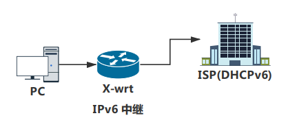
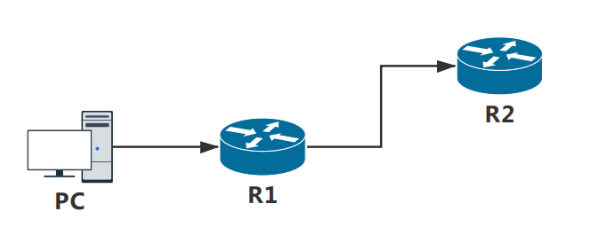

# X-wrt路由器下的客户端如何连接到Internet

## 1. 介绍
一台PC或者手机连接到X-wrt之后, 获取到IPv6地址之后访问Internet, 一般有2种方式实现: [NAT](#)和[中继](#). 
+ [NAT模式](#): <br>
Lan接口可以配置为SLAAC, stateless DHCPv6或者stateful DHCPv6模式.<br>
WAN接口可以配置为static, dhcpv6或者pppoe.<br>
+ [中继模式](#):<br>
这种模式下Lan接口不提供DHCPv6等服务,所以不需要什么, 但是这种模式下wan需要一个IPv6地址, 所以wan可以配置为static, dhcpv6或者pppoe.<br>
中继模式主要是配置dhcp,实现ICMPv6和DHCPv6数据包的代理.<br>
## 2. NAT方式
IPv6本身是不支持NAT, 但是可以通过ip6tables规则做数据转发.
### 2.1 网络拓扑


### 2.2 配置
lan配置以下其中一种模式: [参考](./02-ipv6-lan-config.md)
+ SLAAC
+ stateless DHCPv6
+ stateful DHCPv6

wan配置: [参考](01-ipv6-wan-config.md)
### 2.3 规则
执行以下规则
```sh
$ ip6tables -t nat -A POSTROUTING -o eth0.2 -j MASQUERADE
$ ip6tables -A FORWARD -m conntrack --ctstate RELATED,ESTABLISHED -j ACCEPT
$ ip6tables -A FORWARD -i br-lan -j ACCEPT
```
### 2.4 结果
PC可以获取到lan口分配的IP, 然后访问外网的IPv6地址, 那么在ISP侧看到的PC的数据流的源地址是路由器的WAN口IP.
## 3 中继
不会影响IPv4地址获取
### 3.1 网络拓扑

### 3.2 配置
中继模式DHCP配置: [参考](./02-ipv6-lan-config.md)

还要注意一点是当配置[中继模式](#)时, wan接口要保证配置或者获取到IP, 否则DHCPv6不会被代理到上层, 所以这里建议把wan接口配置为dhcpv6模式.而lan接口就不需要任何配置了! 如下:
```
config interface 'wan6'
        option ifname 'eth0.2'
        option proto 'dhcpv6'
```
当然你也可以配置为其他模式:pppoe或static, 目的是保证wan口有IPv6地址.
### 3.4 结果
PC的ICMPv6或者DHCPv6数据包会被路由器代理到上层网络, PC可以获取ISP分配的IPv6地址(如果ISP支持DHCPv6), 而且PC还是可以获取到X-wrt分配的IPv4地址
## 4 本地前缀代理
sorry, 还没搞清楚!!
### 4.1 网络拓扑

### 4.2 配置
略
